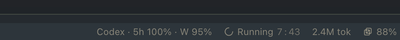

# Hermes Codex Usage

A read-only Hermes Desktop plugin that displays ChatGPT/Codex subscription quota through the authenticated Codex CLI.



## What it shows

- 5-hour and weekly windows when Codex provides them
- model-specific quota windows when present
- used and remaining percentages
- reset times in the local timezone
- plan type and stale/unavailable states

The compact status-bar chip looks like `Codex · 5h 100% · W 95%`. Click it to open the detailed quota pane.

The plugin does not estimate API costs and does not scrape ChatGPT.

## How it works

The backend launches:

```text
codex app-server --stdio
```

It performs the app-server JSON-RPC handshake and calls `account/rateLimits/read`. Codex owns authentication. This plugin does **not** read `~/.codex/auth.json`, Hermes auth files, cookies, or bearer tokens; it also does not return raw Codex responses, account IDs, or stderr to the desktop renderer.

The Codex app-server is currently experimental, so protocol compatibility is intentionally isolated in `dashboard/codex_rpc.py`.

## Install

Requirements:

- Hermes Desktop with the desktop plugin SDK
- Codex CLI installed and logged in with the ChatGPT account whose limits should be shown
- macOS, Linux, or Windows with a supported Hermes installation

From a cloned repository:

```bash
git clone https://github.com/OWNER/hermes-codex-usage.git
cd hermes-codex-usage
./install.sh
hermes plugins enable hermes-codex-usage
hermes gateway restart
```

Then open **Capabilities → Plugins**, enable **Codex Usage**, and choose **⌘K → Reload desktop plugins**. The plugin contributes a `Codex Usage` pane and a compact status-bar chip.

The installer uses the active `$HERMES_HOME` (or `~/.hermes`) and installs the unified Python backend plus desktop half together. If Hermes was installed with a restricted environment, the plugin also checks `~/.local/bin/codex` after looking on `PATH`.

For a profile, set `HERMES_HOME` to that profile's Hermes home when installing and enabling the plugin.

## Development

```bash
uv run --extra test pytest -m 'not live_codex' -v
uv run --extra test pytest -m live_codex -v
hermes plugins validate .
```

The live test invokes the local Codex CLI and is separate from the credential-free test suite. It never asserts current percentages or plan names.

## Uninstall

```bash
./uninstall.sh
hermes gateway restart
```

After uninstalling, disable the desktop half in **Capabilities → Plugins** if it is still listed.

## Privacy and limitations

Usage data is fetched locally and is not sent to a third-party service. The status values are whatever the Codex backend reports; the plugin does not infer fixed plan allowances. A missing CLI, expired login, timeout, or protocol change is displayed as unavailable rather than guessed.

The plugin currently has no notifications, forecasting, automated model switching, TUI surface, or messaging command.

See [SECURITY.md](SECURITY.md) for reporting security issues.

## License

MIT
